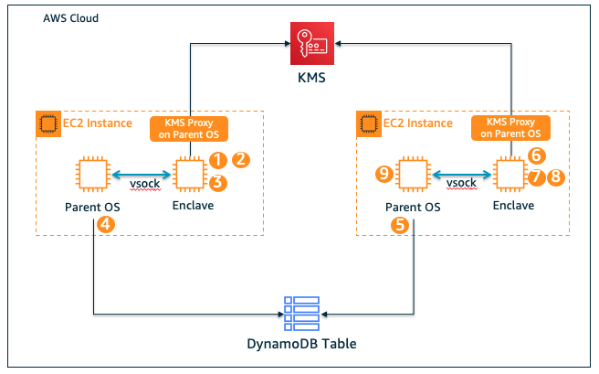
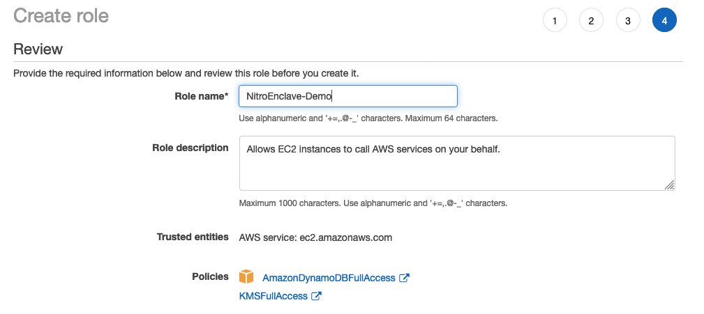
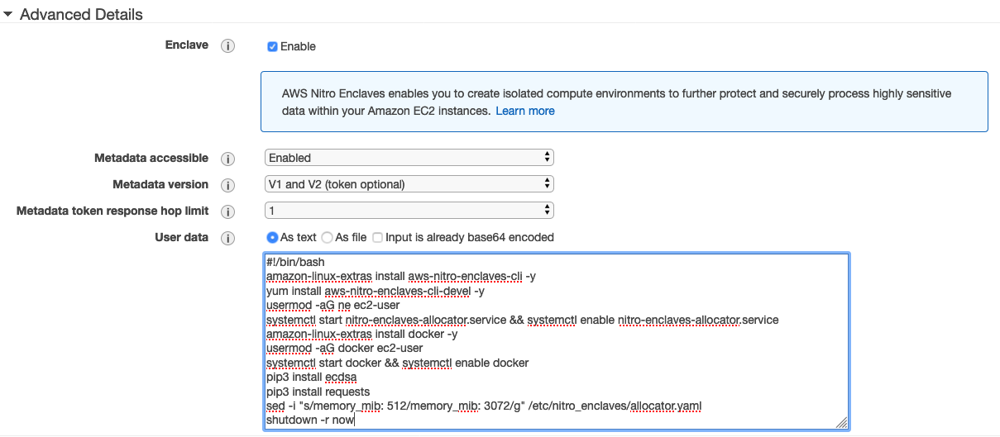
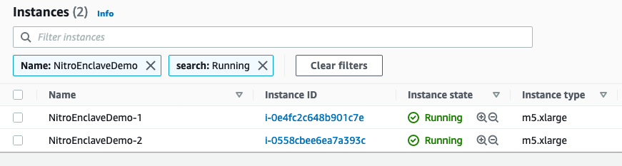
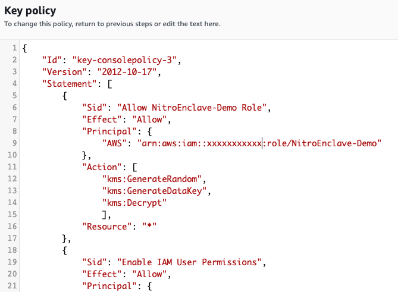
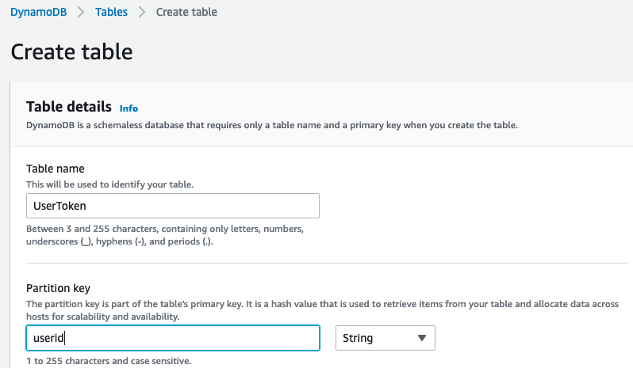
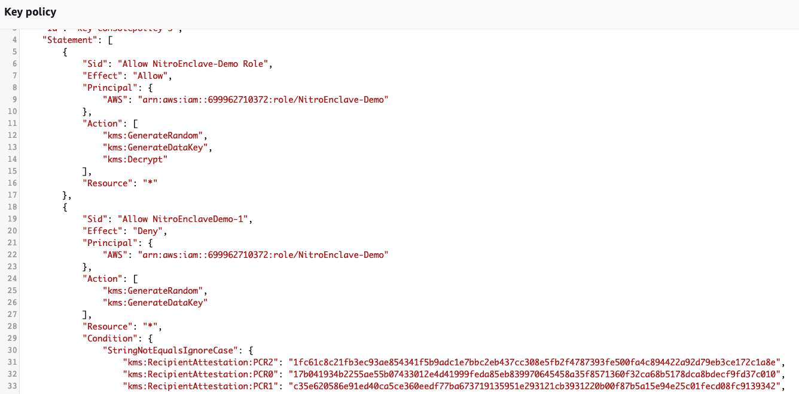
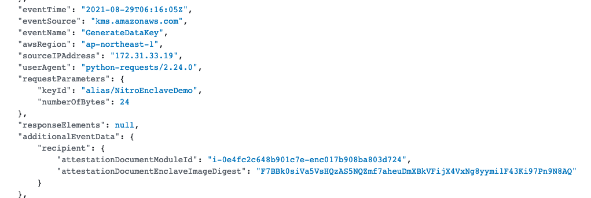
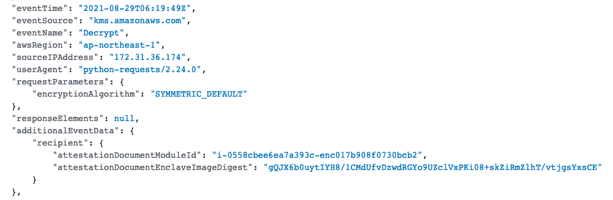

# Nitro Enclave and Attestation Demo


## 部署一个 Nitro Enclave 示例环境，结合 KMS 实现私钥安全
---

下面将以一个私钥管理应用场景的示例，使用 Python 代码演示如何在 Nitro Enclave 中处理私钥数据，并结合 KMS 和 Attestation，保证私钥在加密，解密，存储和签名过程中的安全。该示例将包括：
 - 创建和部署两个 Enclave，一个实现私钥的生成和加密，另一个实现私钥的解密和签名
 - Enclave 通过 vsock 与父实例通信
 - Enclave 通过父实例上运行 KMS Proxy，访问 KMS 服务
 - Enclave 向 Nitro Hypervisor 请求 Attestation 证明文件
 - 在 Enclave 中向 KMS 发送 API 请求时，带上证明文件
 - KMS 服务配置密钥策略，将密钥的访问权限仅授予特定的 Enclave 

私钥管理应用场景示例架构图和工作流如下：


 
 0. 创建一个 KMS Key，启动支持 Enclave 的两台 EC2 实例，分别创建和运行 Enclave，vsock 和 KMS Proxy
 1. 在 Enclave-1 中通过 kms:GenerateRandom API 生成一个 256 位的私钥，利用私钥生成对应的公钥(ecdsa-p256k1)
 2. 在 Enclave-1 中通过 kms:GenerateDataKey API 获取加密密钥（包括一个明文 DataKey 和一个KMS加密的 DataKey），使用明文 DataKey 对私钥进行 Client-Side 加密
 3. 在 Enclave-1 中，将加密的私钥，加密的 DataKey 和公钥，通过 vsock 发送到父实例
 4. 在 EC2-1 父实例中，将从 vsock 中收到的数据（加密的私钥，加密的 DataKey 和公钥）写入到 DynamoDB 数据库
 5. 在 EC2-2 父实例中，从 DynamoDB 中读取一条数据（私钥ID，加密的私钥，加密的 DataKey 和公钥），通过 vsock 将加密的私钥，加密的 DataKey 和需要被签名的消息，发送给 Enclave-2
 6. 在 Enclave-2 中，从vsock接收数据（加密的私钥，加密的 DataKey 和需要被签名的消息），通过 kms:Decrypt API 对加密的 DataKey 进行解密，获取明文 DataKey
 7. 在 Enclave-2 中，使用明文 DataKey 对加密的私钥进行解密，并使用私钥，对消息进行签名
 8. 在 Enclave-2 中，将签名后的消息通过通过 vsock 发送到父实例
 9. 在 EC2-2 父实例中，对送 vsock 接收到的签名消息，使用公钥进行验证

### 1. 基础环境部署
---
#### 1.1 启动两台 EC2 实例，安装依赖包
---

首先创建 EC2 及 Enclave 程序所需的 IAM Role，至少需要具备 DynamoDB 的访问权限。为了简化配置，在 demo 中直接使用了 KMS 和 DynamoDB 托管的 FullAccess 策略。但在生产环境中，不能直接使用托管策略，需要自定义用户策略，进行访问行为和资源级别的精细化授权。



启动两台 Amazon Linux2 的 m5.xlarge EC2 实例(至少 4 vCPU 的 Nitro 实例类型), 需要手动启用 Enclave (创建 EC2 时默认不启用 enclave )



在User Data 中，粘贴以下信息，完成安装 Nitro-CLI ，Docker，以及其他 Enclave 程序所需的依赖包，修改 Enclave 可占用的最大内存，下载 Enclave 示例代码等。
```shell
#!/bin/bash
amazon-linux-extras install aws-nitro-enclaves-cli -y
yum install aws-nitro-enclaves-cli-devel -y
usermod -aG ne ec2-user
systemctl start nitro-enclaves-allocator.service && systemctl enable nitro-enclaves-allocator.service
amazon-linux-extras install docker -y
usermod -aG docker ec2-user
systemctl start docker && systemctl enable docker
yum install git -y
pip3 install ecdsa
pip3 install requests
pip3 install boto3
sed -i "s/memory_mib: 512/memory_mib: 3072/g" /etc/nitro_enclaves/allocator.yaml
su ec2-user -c 'cd /home/ec2-user && git clone https://github.com/hxhwing/Nitro-Enclave-Demo.git'
shutdown -r now
```
EC2 启动完成后，修改实例名称用于标记：
 - 第一台 EC2: NitroEnclaveDemo-1，用于生成，加密私钥，存储到 DynamoDB
 - 第二台 EC2: NitroEnclaveDemo-2，用于解密私钥，签名和验证消息


#### 1.2 创建 KMS Key
---
在 AWS KMS 服务中创建一个对称密钥，用于在 Enclave 中调用 KMS API，进行私钥的生成和加解密。
 - 第一步： 选择对称密钥
 - 第二步： 为 Key 添加别名 ```NitroEnclaveDemo```
 - 第三步： 选择 Key 的管理员用户（只有 Key 管理员可以删除或修改 Key 的权限）
 - 第四步： 密钥使用权限，不选择任何用户或角色
 - 第五步： 修改自动生成的 Key Policy，在 Statements 中添加以下策略，为前面步骤创建的 EC2 Role 分配 "kms:Decrypt","kms:GenerateDataKey","kms:GenerateRandom" 权限，暂不配置策略条件

 ```json
        {
            "Sid": "Allow NitroEnclave-Demo Role",
            "Effect": "Allow",
            "Principal": {
                "AWS": "arn:aws:iam::xxxxxxxxxxx:role/NitroEnclave-Demo"  # Replace account ID
            },
            "Action": [
                "kms:GenerateRandom",
                "kms:GenerateDataKey",
                "kms:Decrypt"
                ],
            "Resource": "*"
        },
 ```



#### 1.3 创建 DynamoDB Table
---
创建一个 DynamoDB Table，用于存放加密后的私钥，加密的 DataKey 和公钥。
 - Table Name:  ```UserToken```
 - Partition key: ```userid (String)```

**```注意:  ``` DynamoDB Table Name 和 Partition key 请与上面完全一致，如果需要修改，请同时相应修改示例程序中 ```client.py``` 的 DynamoDB 相关代码。**



### 2 创建Enclave，运行示例代码
---

示例代码 ```Nitro-Enclave-Demo``` 已经被自动下载到 ec2-user 用户目录下，示例代码包含两个目录 
 - ```GenerateToken``` : 运行在第一台 EC2 ，用于生成和加密私钥的 Enclave 
 -  ```SignVerify```: 运行在第二台 EC2，用于解密私钥，签名和验证消息的
```
[ec2-user@ip-172-31-33-19 ~]$ cd Nitro-Enclave-Demo/
[ec2-user@ip-172-31-33-19 Nitro-Enclave-Demo]$ ls -l
total 4
drwxr-xr-x 2 ec2-user ec2-user  206 Aug 28 16:12 GenerateToken
drwxr-xr-x 2 ec2-user ec2-user   87 Aug 28 16:12 pics
-rw-r--r-- 1 ec2-user ec2-user 3094 Aug 28 16:12 README.md
drwxr-xr-x 2 ec2-user ec2-user  189 Aug 28 16:12 SignVerify
drwxr-xr-x 4 ec2-user ec2-user   51 Aug 28 16:12 src
```

#### 2.1 创建和运行第一个 Enclave，生成和加密私钥
---

首先登录到第一台 EC2，进入 /home/ec2-user/Nitro-Enclave-Demo/GenerateToken/ 目录，主要包括以下几个文件
 - ```main.py```: 运行在 Enclave 中的主程序文件，包括：从 KMS 生成私钥，从 KMS 获取 DataKey，加密私钥，将加密后的数据通过vsock发给父实例
 - ```traffic-fowarder.py```: 运行在 Enclave 中，用于将 Enclave 访问 KMS 的请求通过 vsock 发送到父实例
 - ```kms.py```: 用于获取 Attestation 签名，访问 KMS API，以及解密 KMS API Response
 - ```client.py```: 运行在父实例中的程序文件，包括：从 Enclave 接收加密后的数据，将数据写入到 DynamoDB
 - ```Dockerfile```: Docker 镜像文件，main.py 和 traffic-fowarer.py 都将被打包进容器镜像
 - ```build.sh```: 创建 Docker 镜像，将 Docker 镜像转换为 Enclave 镜像，并运行 Enclave 的自动化脚本
 
1. 运行```build.sh```，创建 Enclave 镜像，并以 ```debug-mode``` 运行 Enclave。其中创建 Enclave 镜像完成后，将自动生成该 Enclave 的 PCR 0/1/2，保存到 ```EnclaveImage.log``` 的文件中.
```
[ec2-user@ip-172-31-33-19 GenerateToken]$ chmod +x build.sh
[ec2-user@ip-172-31-33-19 GenerateToken]$ ./build.sh
```
build 脚本运行完成后， Enclave 将以 debug 模式运行，用户可通过 nitro-cli 连接到运行的 Enclave 控制台，查看 Enclave 运行过程输出到Console的日志，主要用于排错
```
nitro-cli console --enclave-id $(nitro-cli describe-enclaves | jq -r ".[0].EnclaveID")
```

2. 运行 ```client.py``` 代码，运行方式如下：
```
python3 client.py <KMS Key-id> <UserID>
```
其中 “KMS Key-id” 为前面步骤中创建的别名为 NitroEnclaveDemo 的 KMS Key， “UserID” 用于标示即将生成的私钥属于哪个用户。

运行 ```client.py``` 代码后，将自动返回从 Enclave 中接收到的数据，并将数据写入到 DynamoDB Table，数据字段包括：
 - userid:  用于标示私钥属于哪个用户
 - encrypted_privatekey: 在 Enclave 中，被 KMS DataKey 加密后的私钥
 - publickey: 在 Enclave 中，由私钥生成的公钥
 - encrypted_datakey: KMS 加密后的 DataKey，将用于解密私钥
```
[ec2-user@ip-172-31-33-19 GenerateToken]$ python3 client.py alias/NitroEnclaveDemo u001
{"userid": "u001", "encrypted_privatekey": "4xiMsmD1VMw1I48HMApw4LzDSWT9lz/x74dMNCz1427hz98t0JzyrFzDd68vrKl0wKB1a/LoLyhi\nvJSgQwSfCA==\n", "publickey": "0a0756e60e112d11f0d5e4a88858251f1234e27ea37261da4698d497baa6a52bbe9a3d227534866351086d7220548a4ff00fb081c9b318361cac5dae9c661f8c", "encrypted_datakey": "AQIBAHhVM1N8G00xz9DVe3FbnRAxaxNCkCaRYV6/wLYxbwj04QFUWvIkLZ6TYPE2GTUdKvMbAAAAdjB0BgkqhkiG9w0BBwagZzBlAgEAMGAGCSqGSIb3DQEHATAeBglghkgBZQMEAS4wEQQMMhfwZjlaOr8pCQneAgEQgDNMimKpywvNdcpJIgPZUYrhE5uQvzonU5o/uYhPMmZmb/kWotQNH6KSFxuTBdx6FeM0vQs="}
Write User Token to DynamoDB Successfully
[ec2-user@ip-172-31-33-19 GenerateToken]$
```

#### 2.2 创建和运行第二个 Enclave，解密私钥，签名和验证消息
---

登录到第二台 EC2，进入 /home/ec2-user/Nitro-Enclave-Demo/SignVerify 目录：
 - ```main.py```: 运行在 Enclave 中的主程序文件，包括：从 KMS 解密 DataKey，用 DataKey 解密私钥，用私钥签名消息，将签名后的消息通过vsock发给父实例
 - ```client.py```: 运行在父实例中的程序文件，包括：从 DynamoDB 中读取数据，发送到 Enclave，然后从 Enclave 接收被私钥签名后的消息，并使用公钥验证签名消息
 
1. 运行```build.sh```，创建 Enclave 镜像，并以 ```debug-mode``` 运行 Enclave。其中创建 Enclave 镜像完成后，将自动生成该 Enclave 的 PCR 0/1/2，保存到 ```EnclaveImage.log``` 的文件中.
```
[ec2-user@ip-172-31-36-174 SignVerify]$ chmod +x build.sh
[ec2-user@ip-172-31-36-174 SignVerify]$ ./build.sh
```

2. 运行```client.py```代码，运行格式如下：
```
python3 client.py <UserID> <Message to be Signed>
```
其中 “UserID” 代表从 DynamoDB 中读取哪个用户的密钥数据，“Message to be Signed” 代表将被发送到 Enclave 中被私钥签名的消息。

运行 ```client.py``` 代码后，将自动返回从 Enclave 中接收到的数据，数据字段包括：
 - Signed Message:  Enclave 中被私钥签名后的消息
 - Signed message verified by public key: True/False，表示签名的消息是否可以被公钥验证，确保私钥和公钥没有被修改
```
[ec2-user@ip-172-31-36-174 SignVerify]$ python3 client.py u001 'Hellow World'
Signed Message: 6053cfc42883d03888ba175950e463c1d8164cab8b4873b85af8531a0c6f86b8ad07012107e3322d30118ea24976f8c8f70014119159101ecc1797e7a9f72915
Signed message verified by public key: True
[ec2-user@ip-172-31-36-174 SignVerify]$
```

### 2.3 配置 KMS 密钥策略根据 Attestation PCR 授权
---
当以 ```debug-mode``` 运行 Enclave 时，Attestation 证明文件中的 PCR 为全 0，无法用来在外部服务上作为策略条件，进行权限控制。 
```
nitro-cli run-enclave ...... --debug-mode
```

运行 nitro-cli run-enclave 时，不加--debug-mode, 是以正常模式运行 Enclave，Attestation 证明文件中才会包含 Enclave 正常的 PCR。

首先在 KMS 密钥策略，添加相应的 Condition Key 限制 Attestation PCR ，其中 ```kms:RecipientAttestation:ImageSha384``` 与 PCR 0 为相同的值，每个 Enclave 的 PCR 0/1/2，可以在 Build Enclave 镜像的时候获取，本示例是写到所在代码目录下 EnclaveImage.log 文件中。

在 KMS NitroEnclaveDemo 这个 Key 的密钥策略中，添加以下两条 Deny 权限策略语句，到 KMS Key Policy 的 Statement 字段中：
 - 第一段策略，授权只有来自 Enclave-1，且携带 Attestation 证明文件才能访问 kms:GenerateDataKey API，注意请替换为您自己的 PCR 0/1/2 Value
 - 第二段策略，授权只有来自 Enclave-2 ，且携带 Attestation 证明文件才能访问 kms:Decrypt API，注意请替换为您自己的 PCR 0/1/2 Value
```json
        {
            "Sid": "Only Allow NitroEnclaveDemo-1",
            "Effect": "Deny",
            "Principal": {
                "AWS": "arn:aws:iam::xxxxxxxxxxx:role/NitroEnclave-Demo"
            },
            "Action": [
                "kms:GenerateRandom",
                "kms:GenerateDataKey"
            ],
            "Resource": "*",
            "Condition": {
              "StringNotEqualsIgnoreCase": {
                "kms:RecipientAttestation:ImageSha384":"17b041934b2255ae55b07433012e4d41999feda85eb839970645458a35f8571360f32ca68b5178dca8bdecf9fd37c010",
                "kms:RecipientAttestation:PCR0":"17b041934b2255ae55b07433012e4d41999feda85eb839970645458a35f8571360f32ca68b5178dca8bdecf9fd37c010",
                "kms:RecipientAttestation:PCR1":"c35e620586e91ed40ca5ce360eedf77ba673719135951e293121cb3931220b00f87b5a15e94e25c01fecd08fc9139342", 
                "kms:RecipientAttestation:PCR2":"1fc61c8c21fb3ec93ae854341f5b9adc1e7bbc2eb437cc308e5fb2f4787393fe500fa4c894422a92d79eb3ce172c1a8e"
              }
            }
        },
        {
            "Sid": "Only Allow NitroEnclaveDemo-2",
            "Effect": "Deny",
            "Principal": {
                "AWS": "arn:aws:iam::xxxxxxxxxxx:role/NitroEnclave-Demo"
            },
            "Action": [
                "kms:Decrypt"
            ],
            "Resource": "*",
            "Condition": {
              "StringNotEqualsIgnoreCase": {
                "kms:RecipientAttestation:ImageSha384":"810257e9bd2ecad2181fcff508c7547ef0f3c1d446628f5465c955c4f2a2d3cfac9198919999614ffbed8e0b18c6c084",
                "kms:RecipientAttestation:PCR0":"810257e9bd2ecad2181fcff508c7547ef0f3c1d446628f5465c955c4f2a2d3cfac9198919999614ffbed8e0b18c6c084",
                "kms:RecipientAttestation:PCR1":"c35e620586e91ed40ca5ce360eedf77ba673719135951e293121cb3931220b00f87b5a15e94e25c01fecd08fc9139342", 
                "kms:RecipientAttestation:PCR2":"72457ef34f66f041996e7077f55604f0f73b1d2e3fad54881308d38da6d22bc8cd2084ab3b8810b22da629a24eef94e6"
              }
            }
        },
```


在 EC2 上直接用 AWS CLI 访问 KMS，提示请求被拒绝，确认密钥策略权限已生效
```
[ec2-user@ip-172-31-33-19 ~]$ aws kms generate-data-key --key-id alias/NitroEnclaveDemo --number-of-bytes 32 --region ap-northeast-1

An error occurred (AccessDeniedException) when calling the GenerateDataKey operation: User: arn:aws:sts::xxxxxxxxxx:assumed-role/NitroEnclave-Demo/i-0e4fc2c648b901c7e is not authorized to perform: kms:GenerateDataKey on resource: arn:aws:kms:ap-northeast-1:xxxxxxxxxx:key/6390f2e0-86d6-46cb-8478-37dcfa6aa2dc with an explicit deny
```

分别在两台 EC2 上执行以下命令，终止前面步骤启动的 Enclave
```
nitro-cli terminate-enclave --enclave-id $(nitro-cli describe-enclaves | jq -r ".[0].EnclaveID")
```

然后在两台 EC2 上重新启动 Enclave，不添加 --debug-mode 参数
```
## NitroEnclaveDemo-1
[ec2-user@ip-172-31-33-19 GenerateToken]$ nitro-cli run-enclave --cpu-count 2 --memory 2900 --enclave-cid 10 --eif-path GenerateToken-demo.eif
Start allocating memory...
Started enclave with enclave-cid: 10, memory: 3072 MiB, cpu-ids: [1, 3]
{
  "EnclaveID": "i-0e4fc2c648b901c7e-enc17b908ba803d724",
  "ProcessID": 7565,
  "EnclaveCID": 10,
  "NumberOfCPUs": 2,
  "CPUIDs": [
    1,
    3
  ],
  "MemoryMiB": 3072
}


## NitroEnclaveDemo-2
[ec2-user@ip-172-31-36-174 SignVerify]$ nitro-cli run-enclave --cpu-count 2 --memory 2900 --enclave-cid 10 --eif-path SignVerify-demo.eif
Start allocating memory...
Started enclave with enclave-cid: 10, memory: 3072 MiB, cpu-ids: [1, 3]
{
  "EnclaveID": "i-0558cbee6ea7a393c-enc17b908f0730bcb2",
  "ProcessID": 7533,
  "EnclaveCID": 10,
  "NumberOfCPUs": 2,
  "CPUIDs": [
    1,
    3
  ],
  "MemoryMiB": 3072
}
```

然后分别在两台 EC2 的父实例上，运行```client.py```，确认代码能正常运行。
```
## NitroEnclaveDemo-1
[ec2-user@ip-172-31-33-19 GenerateToken]$ python3 client.py alias/NitroEnclaveDemo u010
{"userid": "u010", "encrypted_privatekey": "h08szIyVaTrjH1TF95+aXooPKC/QZwGRDaZv7Cp/LmFG2FQumbZR49NrnsOYBsS+VxsvPtSlBE2s\nnEYQLMI9lQ==\n", "publickey": "9552c9f2c51be3b7143e3cfe9c71f7dcac028d368530ffbbdb34512092611e4996e9e1bcab27e4a879ff630629d7f930d2db84c295e97334d1f3335d31e7ac87", "encrypted_datakey": "AQIBAHhVM1N8G00xz9DVe3FbnRAxaxNCkCaRYV6/wLYxbwj04QFKhpZ//ap2EgINgILddtu0AAAAdjB0BgkqhkiG9w0BBwagZzBlAgEAMGAGCSqGSIb3DQEHATAeBglghkgBZQMEAS4wEQQMScLI1DYM6y6hd0d4AgEQgDO2pbbcrEEd+trVcqiqkFdlhXY/ZVEMoRqRsQAUMdJq24zwGgl6UYOjLCviBHs2wI8jC5A="}
Write User Token to DynamoDB Successfully
[ec2-user@ip-172-31-33-19 GenerateToken]$

## NitroEnclaveDemo-2
[ec2-user@ip-172-31-36-174 SignVerify]$ python3 client.py u010 'Hello World'
Signed Message: b27a5c527e218774b316f674eae537ce88b3f986b7f5df583906b1c9a9ba9bb00d2975fe4a065d5a1e74bb6947fe11c8fc90d3ac389be638b2745431de04ebd9
Signed message verified by public key: True
[ec2-user@ip-172-31-36-174 SignVerify]$
```

在 CloudTrail 中，查看 KMS API 的请求记录，在来自 Enclave 的请求记录中，将会存在额外的 Attestation 数据。

来自第一台 Enclave 请求 kms:GenerateDataKey 的 CloudTrail：


来自第二台 Enclave 请求 kms:Decrypt 的 CloudTrail：


## License

This project is licensed under the Apache-2.0 License.
  